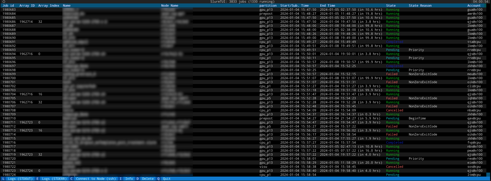

# SlurmTUI
[](https://badge.fury.io/py/slurmtui)


A simple Terminal UI for monitoring SLURM jobs.

### Note: SlurmTUI requires slurm 21.08 or later for the Json output support.

## Installation
```bash
pip install slurmtui
```

## Usage
Just run `slurmtui` in your terminal.

Environment variables:
- `UPDATE_INTERVAL`: Refresh rate in seconds (default: 10)
- `TAIL_LINES`: Number of lines to show in the tail (default: -1, show all)




# FAQ

### How to select text in the App?
JobUI is running a Textual app which puts your terminal in to application mode which disables clicking and dragging to select text. Most terminal emulators offer a modifier key which you can hold while you click and drag to restore the behavior you may expect from the command line. The exact modifier key depends on the terminal and platform you are running on.

- iTerm Hold the OPTION key.
- Gnome Terminal Hold the SHIFT key.
- Windows Terminal Hold the SHIFT key.

Refer to the documentation for your terminal emulator, if it is not listed above.

# Contact
- [Wissam Antoun](https://github.com/WissamAntoun/)