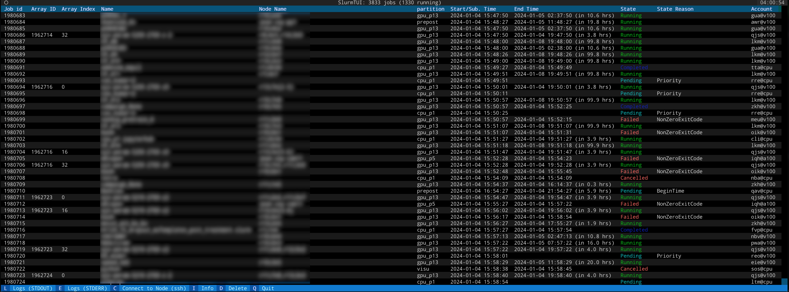

# SlurmTUI
[](https://badge.fury.io/py/slurmtui)


A terminal user interface for monitoring and managing Slurm jobs. Instead of running `squeue`, `sacct`, and `scancel` over and over, you get a live-updating table of your jobs with colors, sorting, filtering, and shortcuts to tail logs, SSH into nodes, or delete jobs — all without leaving the TUI.

Built with [Textual](https://textual.textualize.io/) and [Rich](https://rich.readthedocs.io/).

> **Note:** SlurmTUI requires Slurm 21.08 or later for JSON output support.
>
> **Note:** Viewing old jobs requires Slurm 24.05 or later.

## Installation

```bash
pip install slurmtui
```

## Usage

Just run `slurmtui` / `slurmui` / `sui` in your terminal.

### Command-line options

Filter by account at launch:
```bash
slurmtui --acc my_account1,my_account2
```

View all users' jobs:
```bash
slurmtui --check_all_jobs
```

Override the update interval:
```bash
slurmtui --update-interval 5
```

Pass extra arguments to `squeue`:
```bash
slurmtui -- --partition=gpu
```

### Settings

All preferences are stored in `~/.config/slurmtui/settings.json` and persist across sessions. You can override the settings path by setting the `SLURMTUI_SETTINGS` environment variable.

## Features

### Live Job Table

The main view auto-refreshes every few seconds, showing your jobs with colored states (green for running, red for failed, etc.). Filter jobs by account, partition, or any column.



### Keybindings

| Key | Action |
|-----|--------|
| `L` | Tail stdout log |
| `E` | Tail stderr log |
| `Ctrl+L` | Open stdout in secondary text viewer |
| `Ctrl+E` | Open stderr in secondary text viewer |
| `C` | SSH into the job's node |
| `D` | Delete a job (with confirmation, works with array jobs) |
| `I` | View detailed job info |
| `O` | Toggle old jobs history (completed/failed via `sacct`) |
| `U` | Live utilization monitor (CPU, RAM, GPU) |
| `R` | Open hardware resources view |

The log viewer can be configured to use `tail -f`, `less`, or any command you want.

### Old Jobs History

View completed/failed job history via `sacct`. Press `O` to toggle. For more info see the linked [blog post](https://wiss.dev/posts/software/slurmtui/#old-jobs-history)

### Live Utilization Monitor

Press `U` on a job or node to open a live-updating utilization screen with braille-resolution charts for CPU, RAM, and GPU (utilization, VRAM, power draw). Supports job-scoped monitoring via cgroup v2 and node-level fallback via `/proc`. Requires SSH access to compute nodes.

### Hardware Resources View

See node allocation and availability across the cluster. Press `R` to open. For more info see the linked [blog post](https://wiss.dev/posts/software/slurmtui/#hardware-resources-view).

## Roadmap

- [x] View old jobs
- [x] Filtering jobs when launching
- [x] Sorting
- [x] Options other than tail for logs
- [x] Faster launch
- [x] Remove Array columns if no job array exists
- [x] Display used/available resources
- [ ] Search

Have a feature request? [Suggest it here](https://github.com/WissamAntoun/SlurmTUI/issues/4)

## FAQ

### How to select text in the App?

SlurmTUI runs a Textual app which puts your terminal into application mode, disabling clicking and dragging to select text. Most terminal emulators offer a modifier key which you can hold while you click and drag to restore normal selection:

- **iTerm** — Hold the OPTION key.
- **Gnome Terminal** — Hold the SHIFT key.
- **Windows Terminal** — Hold the SHIFT key.

Refer to the documentation for your terminal emulator if it is not listed above.

## License

MIT

## Contact

- [Wissam Antoun](https://github.com/WissamAntoun/)
